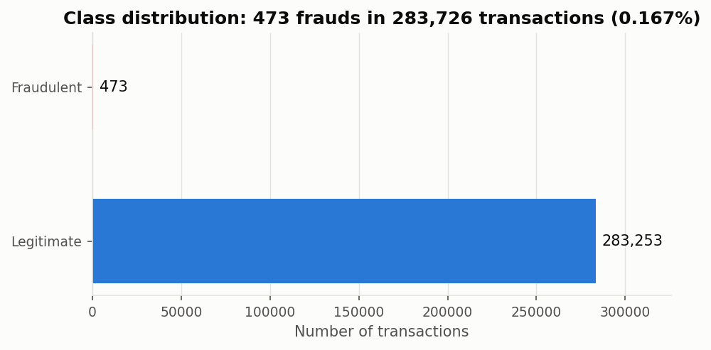
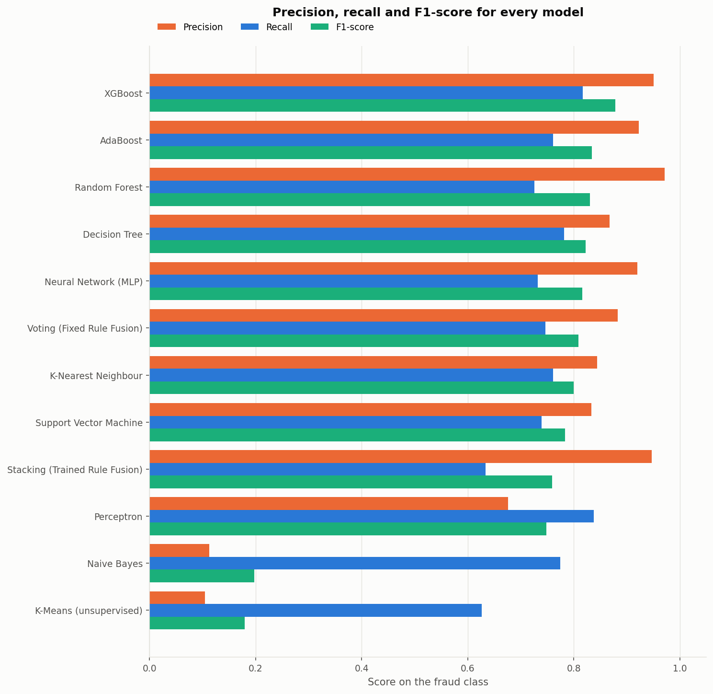
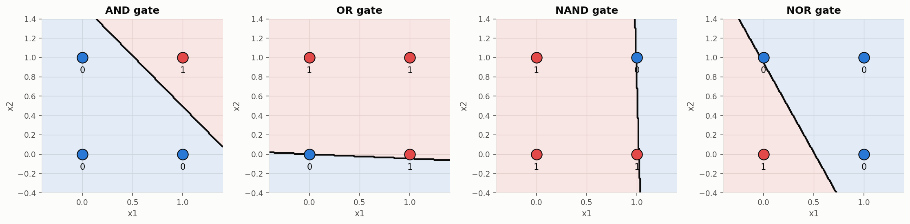
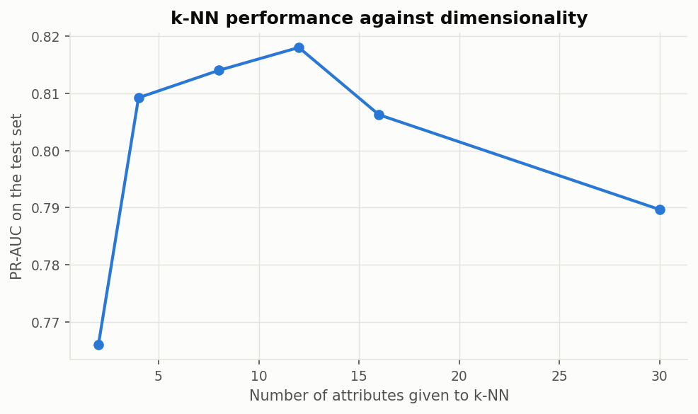
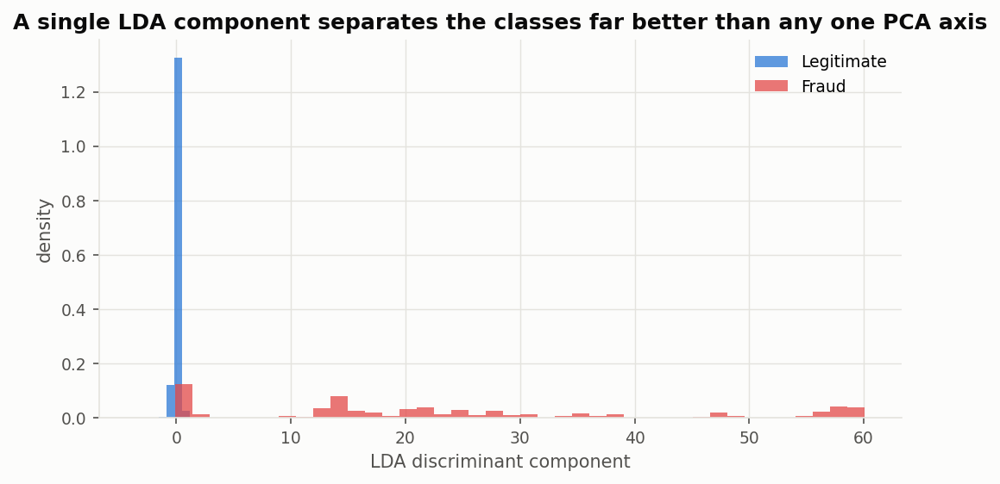
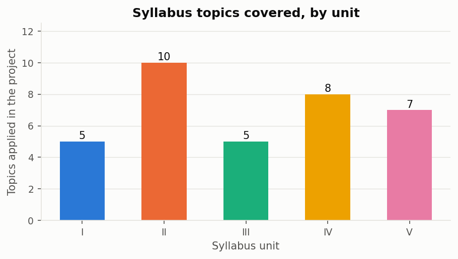

# Credit Card Fraud Detection using Machine Learning

**B.Tech Computer Science and Engineering · SRM University – AP**
Machine Learning End-Semester Project · September 2026
Supervisor: **Mr. Ajay Dilip Kumar Marapatla**

### Team

| Name | Roll No |
|---|---|
| Akshita Modi | AP24110010386 |
| Lakshay | AP24110010677 |
| Mohana Krishna Reddy Pittu | AP24110011262 |
| Nadimpally Dheva Harshit | AP24110011553 |

---

## Abstract

Credit card fraud causes substantial financial losses worldwide, and the volume
of modern payment traffic makes manual review impossible. Machine learning
offers a route to automating detection by learning the patterns that separate
fraudulent transactions from legitimate ones.

This project applies the **complete Machine Learning syllabus — all five
units** — to that problem, using the benchmark dataset published by the Machine
Learning Group of the Université Libre de Bruxelles. The dataset contains
284,807 transactions of which only 492 are fraudulent, a prevalence so low that
a classifier predicting "legitimate" for every transaction attains **99.83%
accuracy while detecting nothing**. Accuracy is therefore rejected as an
evaluation metric in favour of recall, precision, F1-score and the area under
the precision–recall curve.

Twelve models were trained and evaluated on an identical stratified split:
decision tree using the ID3 entropy criterion, k-nearest neighbour, Gaussian
naive Bayes, a support vector machine with an RBF kernel, a perceptron, a
multilayer network trained by backpropagation, bagging, Random Forest, AdaBoost,
XGBoost, a fixed-rule voting ensemble, a trained-rule stacking ensemble, and
unsupervised K-means clustering. Supporting analyses cover the curse of
dimensionality, univariate and multivariate feature selection, Principal
Component Analysis, Linear Discriminant Analysis, and computational learning
theory.

**XGBoost performed best**, achieving precision 0.9508, recall 0.8169 and an
F1-score of 0.8788 — detecting 116 of 142 fraudulent transactions in the test
set while raising only 6 false alarms. Five-fold cross validation confirmed the
ranking.

**Keywords:** Credit Card Fraud Detection, Class Imbalance, Decision Tree, ID3,
K-Nearest Neighbour, Naive Bayes, Bayes Optimal Decision, Support Vector
Machine, Perceptron, Backpropagation, Ensemble Learning, Rule Fusion,
Clustering, PCA, LDA.

---

## Overview

Payment card fraud is a large and persistent problem. According to The Nilson
Report, global payment card fraud losses reached **USD 33.41 billion in 2024**,
and cumulative losses over the coming decade are projected at **USD 407.60
billion** [7]. The United States alone accounted for 41.87% of worldwide fraud
losses despite representing a far smaller share of transaction volume.

Fraud takes two broad forms. In the first, an identity thief opens a new credit
card account in someone else's name. In the second — the form this project
addresses — a thief uses an *existing* account, typically after stealing the
card details, and makes transactions the genuine cardholder never authorised.

Detecting the second form is a classification problem: given the attributes of a
transaction, decide whether it is fraudulent. What makes it a demanding one is
not the classification itself but the **rarity of the positive class**.
Fraudulent transactions are a fraction of a percent of all records, which breaks
the metric most people reach for first and limits how much any model can learn
about the minority class.

This project treats that difficulty as the central subject rather than an
inconvenience, and uses it as the thread connecting all five units of the course.

---

## Project Goals

1. **Apply every unit of the syllabus to one real problem.** Rather than
   studying algorithms in isolation, implement the methods from Units I to V on
   a single dataset so their relative strengths become visible.
2. **Build a fair comparison.** Establish one leakage-free experimental protocol
   so that every model is trained and evaluated on identical data, and identify
   the best performer with supporting evidence.
3. **Measure the right thing.** Demonstrate why accuracy fails at 0.17%
   prevalence and evaluate using metrics appropriate to extreme class imbalance.
4. **Verify theory experimentally.** Test four theoretical results from the
   syllabus against real data rather than restating them.
5. **Make it reproducible.** Seed every stochastic component with 77 — the last
   two digits of the author's roll number, as required — so that every figure in
   this repository can be regenerated exactly.

---

## Data Source

The dataset was retrieved from Kaggle and was published by the Machine Learning
Group of the Université Libre de Bruxelles [6]. It contains transactions made by
European cardholders over two days in September 2013.

**Dataset:** [kaggle.com/datasets/mlg-ulb/creditcardfraud](https://www.kaggle.com/datasets/mlg-ulb/creditcardfraud)

| Property | Raw | After cleaning |
|---|---|---|
| Transactions | 284,807 | 283,726 |
| Attributes | 30 + class label | 30 + class label |
| Fraudulent | 492 (0.1727%) | 473 (0.1667%) |
| Duplicate rows | 1,081 | 0 |
| Missing values | 0 | 0 |
| Time span | 172,792 s (≈48 hours) | 172,792 s |
| Mean fraudulent amount | EUR 122.21 | EUR 123.87 |
| Mean legitimate amount | EUR 88.29 | EUR 88.41 |

Of the 30 attributes, **28 (`V1`–`V28`) are numeric variables that have been
transformed using PCA** to protect the confidentiality and privacy of
cardholders. The three remaining fields are `Time`, the elapsed seconds between
the first transaction and each subsequent one; `Amount`, the transaction value;
and `Class`, the binary label where 1 indicates a fraudulent transaction and 0
indicates a legitimate one.

**1,081 exact duplicate rows were removed before any other processing.** If a
transaction appears twice and the train/test split places one copy in each part,
the model is evaluated on a record it has already memorised and the reported
performance is optimistic. None of the reference implementations of this
benchmark removes them.



---

## The problem in one number

A classifier that ignores its input entirely and predicts "legitimate" for every
transaction achieves:

| | |
|---|---|
| **Accuracy** | **99.8333%** |
| **Frauds detected** | **0 of 473** |

This single fact shapes every decision in the project. Accuracy is reported
exactly once in the results below, next to this number, so that its inadequacy
remains visible. Every model is judged on **recall**, **precision**,
**F1-score** and **PR-AUC** instead.

---

## Algorithms

Each algorithm is drawn from a specific unit of the course syllabus.

### Unit II — Decision tree and instance based learning
1. **Decision Tree (ID3, entropy criterion)** — entropy and information gain computed by hand before the library is used
2. **K-Nearest Neighbour (k-NN)** — Euclidean distance worked step by step, k chosen by cross validation

### Unit III — Bayesian learning and support vector machines
3. **Gaussian Naive Bayes** — with the Bayes optimal decision rule derived from a loss matrix
4. **Support Vector Machine (RBF kernel)** — dual formulation, soft margin, kernel comparison

### Unit IV — Artificial neural networks
5. **Perceptron** — implemented from the learning rule; learns AND, OR, NAND, NOR; fails on XOR
6. **Multilayer Network (MLP, backpropagation)** — solves XOR and classifies the fraud data

### Unit V — Ensembles, rule fusion and clustering
7. **Bagging** — bootstrap aggregation over unpruned trees
8. **Random Forest** — bagging plus attribute subsampling at each split
9. **AdaBoost** — sequential reweighting of misclassified examples
10. **XGBoost** — gradient boosting on residuals
11. **Voting ensemble** — *fixed rule fusion* (majority, mean, product, max, min rules)
12. **Stacking ensemble** — *trained rule fusion* with a meta-learner
13. **K-Means clustering** — unsupervised detection, labels withheld entirely
14. **Hierarchical clustering** — agglomerative, with dendrogram and four linkage criteria

### Unit II — Supporting analysis
15. **Principal Component Analysis (PCA)** — variance analysis and projection
16. **Linear Discriminant Analysis (LDA)** — supervised projection, contrasted against PCA
17. **Univariate feature selection** — ANOVA F-test and mutual information
18. **Multivariate feature selection** — Recursive Feature Elimination

*Note:* Logistic Regression appears only as the meta-learner inside the stacking
ensemble, not as a standalone model, because it is not a topic in this course's
syllabus.

---

## Methodology

- **Duplicates removed before splitting** — see Data Source above
- **One stratified 70/30 split**, `random_state = 77`, used identically by every model
- **Scaling inside pipelines**, so no statistic computed on the test set influences training
- **Any resampling confined to cross-validation folds**
- **5-fold stratified cross validation** for model selection

| | Transactions | Frauds | Fraud rate |
|---|---|---|---|
| Training set | 198,608 | 331 | 0.1667% |
| Test set | 85,118 | 142 | 0.1668% |

k-NN and the RBF-SVM were trained on a reduced training sample for
tractability, retaining every fraud case. The test set was never touched, so the
comparison remains valid; the subsampling is declared rather than concealed.

---

## Results

Test set: **85,118 transactions, 142 of them fraudulent.**

| Model | Unit | Accuracy | Precision | Recall | F1 | PR-AUC | Caught | Missed | False alarms |
|---|---|---|---|---|---|---|---|---|---|
| **XGBoost** | V | 0.9996 | 0.9508 | **0.8169** | **0.8788** | **0.8774** | 116 | 26 | 6 |
| AdaBoost | V | 0.9995 | 0.9231 | 0.7606 | 0.8340 | 0.8289 | 108 | 34 | 9 |
| Random Forest | V | 0.9995 | **0.9717** | 0.7254 | 0.8306 | 0.8659 | 103 | 39 | **3** |
| Decision Tree | II | 0.9994 | 0.8672 | 0.7817 | 0.8222 | 0.8075 | 111 | 31 | 17 |
| Neural Network (MLP) | IV | 0.9994 | 0.9204 | 0.7324 | 0.8157 | 0.8498 | 104 | 38 | 9 |
| Voting — fixed rule fusion | V | 0.9994 | 0.8833 | 0.7465 | 0.8092 | — | 106 | 36 | 14 |
| k-Nearest Neighbour | II | 0.9994 | 0.8438 | 0.7606 | 0.8000 | 0.7897 | 108 | 34 | 20 |
| Support Vector Machine | III | 0.9993 | 0.8333 | 0.7394 | 0.7836 | 0.7841 | 105 | 37 | 21 |
| Stacking — trained rule fusion | V | 0.9993 | 0.9474 | 0.6338 | 0.7595 | 0.8375 | 90 | 52 | 5 |
| Perceptron | IV | 0.9991 | 0.6761 | 0.8380 | 0.7484 | — | 119 | 23 | 57 |
| Naive Bayes | III | 0.9895 | 0.1128 | 0.7746 | 0.1970 | 0.1828 | 110 | 32 | 865 |
| K-Means (unsupervised) | V | 0.9904 | 0.1045 | 0.6268 | 0.1791 | 0.1572 | 89 | 53 | 763 |



**Read the accuracy column against 99.8333%.** Several models differ from a
classifier that catches nothing by less than 0.05 percentage points, while their
recall ranges from 0.63 to 0.84. That is the entire argument for not using
accuracy on this problem.

### Cross-validated confirmation

| Model | CV F1 (mean ± std) | Training time |
|---|---|---|
| Random Forest | 0.8319 ± 0.0127 | 59.0 s |
| XGBoost | 0.8293 ± 0.0304 | 9.0 s |
| Decision Tree | 0.8011 ± 0.0409 | 22.3 s |
| Perceptron | 0.5843 ± 0.2941 | 1.5 s |
| Naive Bayes | 0.2381 ± 0.0167 | 0.7 s |

The ranking holds, so the conclusion is a property of the models rather than of
one fortunate split. Random Forest's low standard deviation is precisely the
variance reduction bagging is designed to deliver; the perceptron's high one
reflects its instability on a non-separable problem.

---

## Key findings

**The perceptron fails on XOR, exactly as the theory predicts.** It learns AND,
OR, NAND and NOR within a few epochs — each is linearly separable — and then its
error count never reaches zero on XOR. A hidden layer solves it.



**The curse of dimensionality is measurable on real data.** k-NN performance
*peaks* at a modest number of attributes and then declines as more are added,
even though the extra attributes carry genuine information.



**LDA separates the classes better with one component than PCA does with two** —
which is what the two objectives predict, since PCA maximises variance and never
looks at the class label.



**The Bayes optimal threshold is not 0.5.** Deriving it from the loss matrix
gives τ\* = C_FP/(C_FP + C_FN) = 1/51 ≈ 0.0196. Applying it required a step the
derivation does not mention: naive Bayes posteriors are not calibrated, so
isotonic calibration was needed before the derived threshold matched the
empirical optimum.

**K-means recovers fraud structure without labels.** Clustering the transactions
blind produced clusters with strongly unequal fraud rates.

---

## Syllabus coverage

All five units are applied — **35 topics** in total.



| Unit | Topic from the unitization plan | Notebook |
|---|---|---|
| **I** | Types of learning; supervised vs unsupervised | 01, 09 |
| I | Training, testing and validation of models | 01 |
| I | Cross validation | 03, 04, 10 |
| I | Overfitting and underfitting | 01, 03 |
| I | Evaluation of the model | 10 |
| **II** | Decision tree representation, ID3, entropy | 03 |
| II | Hypothesis space search, inductive bias | 03 |
| II | Issues in decision tree learning | 03 |
| II | Instance based learning, k-nearest neighbour | 04 |
| II | Curse of dimensionality | 02, 04 |
| II | Univariate feature selection | 02 |
| II | Multivariate feature selection | 02 |
| II | Feature selection techniques | 02 |
| II | Feature reduction: **PCA** | 02 |
| II | Feature reduction: **LDA** | 02 |
| **III** | Probability and classification, Bayesian learning | 05 |
| III | Naive Bayes | 05 |
| III | **Bayes optimal decisions** | 05 |
| III | SVM: introduction, dual formulation | 06 |
| III | Maximum margin with noise, kernel functions | 06 |
| **IV** | ANN representation, biological motivation | 07 |
| IV | McCulloch-Pitts neuron | 07 |
| IV | Perceptron, perceptron learning | 07 |
| IV | **Logic gates using perceptron** | 07 |
| IV | Problem with perceptron (XOR) | 07 |
| IV | Gradient descent | 07 |
| IV | Multilayer networks, backpropagation | 07 |
| IV | Computational learning theory, VC dimension | 07 |
| **V** | Ensembles: bagging | 08 |
| V | Random Forest | 08 |
| V | Ensembles: boosting | 08 |
| V | **Fixed rule fusion techniques** | 08 |
| V | **Trained rule fusion techniques** | 08 |
| V | Clustering: K-means | 09 |
| V | Hierarchical clustering | 09 |

---

## Notebooks

| # | Notebook | Contents |
|---|---|---|
| 01 | **Data Exploration and Preprocessing** | Class imbalance, why accuracy fails, duplicate removal, the stratified split, an overfitting/underfitting demonstration |
| 02 | **Feature Selection and Feature Reduction** | Curse of dimensionality measured on the data, filter/wrapper/embedded selection, PCA variance analysis, LDA projection |
| 03 | **Decision Tree Learning (ID3)** | Entropy and information gain computed by hand, hypothesis space search, inductive bias, pruning by cross validation |
| 04 | **K-Nearest Neighbour** | Euclidean distance worked step by step and checked against scikit-learn, choosing k, dimensionality effect measured |
| 05 | **Naive Bayes and Bayes Optimal Decisions** | Bayes theorem, the naive assumption tested on the data, the Bayes optimal threshold derived, and why calibration is needed to apply it |
| 06 | **Support Vector Machine** | Primal and dual formulations, soft margin, kernel comparison, margin and support vectors visualised |
| 07 | **Artificial Neural Networks** | McCulloch-Pitts neuron, perceptron learning logic gates, failing on XOR, gradient descent, backpropagation, VC dimension |
| 08 | **Ensemble Learning** | Bagging, Random Forest, AdaBoost, XGBoost, fixed rule fusion, trained rule fusion |
| 09 | **Clustering** | K-means with the elbow method, clusters compared against hidden labels, anomaly scoring, hierarchical clustering and dendrogram |
| 10 | **Model Comparison and Results** | All results collected, cross-validated comparison, syllabus coverage, conclusion |

---

## Future Work

1. **Resampling techniques.** Apply SMOTE and related methods to address the
   imbalance at the data level, and compare against the metric-level and
   threshold-level approaches used here.
2. **Radial Basis Function networks.** The RBF network is covered in Unit IV but
   was not implemented; it would be a natural addition to the Unit IV comparison.
3. **A larger and more recent dataset.** This benchmark covers two days from
   2013. A dataset spanning months would permit studying how fraud patterns
   change over time, which no model here can address.
4. **Per-transaction cost modelling.** Extend the Bayes optimal decision analysis
   to every model, and make the cost of a missed fraud depend on the transaction
   amount rather than treating it as a constant.
5. **Additional data sources.** Merging location data — for instance, detecting
   that a card was used in one city while the cardholder's phone was in another —
   would add signal that transaction attributes alone cannot provide.
6. **Semi-supervised combination.** Combine the unsupervised clustering with the
   supervised models, so that transactions unlike anything seen before are
   flagged even when no labelled example resembles them.

---

## Conclusion

The objective of this project was to find the most suitable model for credit
card fraud detection among the machine learning techniques taught in the course,
and to do so using a method that makes the comparison trustworthy.

**XGBoost performed best**, with precision 0.9508, recall 0.8169 and an F1-score
of 0.8788 — detecting 116 of 142 fraudulent transactions while raising only 6
false alarms. Five-fold cross validation confirmed the ranking, with Random
Forest and XGBoost close together at the top. Ensemble methods occupied the
three highest positions, with boosting outperforming bagging.

The project's central methodological finding is that **accuracy is unusable at
this class imbalance.** Every model scores above 98.9%, and most sit within a
fraction of a percentage point of a classifier that detects no fraud at all. Any
conclusion drawn from the accuracy column alone would be meaningless.

Beyond the comparison, four theoretical results from the syllabus were verified
experimentally rather than merely stated: the perceptron converged on four
linearly separable logic gates and failed on XOR; k-nearest neighbour
performance declined as attributes were added; the Bayes optimal decision
threshold could only be applied after calibrating the posteriors; and bagging
produced exactly the variance reduction the bias–variance decomposition
predicts.

**Limitations.** The dataset is from 2013 and covers only two days. Its
attributes are PCA components, so no domain-informed feature engineering was
possible. Two models were trained on subsampled data for tractability. Only 331
fraudulent transactions were available for training, which limits what any
high-capacity model can learn.

---

## Reproducing

```bash
git clone https://github.com/lakshay8toic/Credit-Card-Fraud-Detection.git
cd Credit-Card-Fraud-Detection
pip install -r requirements.txt

# place creditcard.csv in Dataset/  (see Dataset/README.md)
jupyter notebook Code/
```

Run the notebooks **in order, 01 through 10**. Notebook 10 reads the result files
written by the earlier notebooks into `Results/tables/`.

Every stochastic component is seeded with `RANDOM_STATE = 77` in
`Code/utils.py`, so re-running reproduces every number in this README exactly.

## Repository layout

```
Credit-Card-Fraud-Detection/
├── Code/                  10 notebooks + utils.py (shared split and metrics)
├── Dataset/               download instructions (the CSV is not committed)
├── Report/                project report (47 pages, PDF)
├── Presentation/          viva presentation (20 slides, PPTX)
├── Project Proposal/      project proposal (12 pages, PDF)
├── Results/
│   ├── figures/           61 figures, all generated by the notebooks
│   └── tables/            metrics for every model, in CSV and JSON
├── README.md
├── requirements.txt
└── LICENSE
```

---

## References

1. J. O. Awoyemi, A. O. Adetunmbi and S. A. Oluwadare, "Credit card fraud detection using machine learning techniques: A comparative analysis," *ICCNI*, IEEE, 2017, pp. 1–9.
2. A. A. Compagnino *et al.*, "An Introduction to Machine Learning Methods for Fraud Detection," *Applied Sciences*, vol. 15, no. 21, art. 11787, 2025.
3. L. Hernandez Aros *et al.*, "Financial fraud detection through the application of machine learning techniques: a literature review," *Humanities and Social Sciences Communications*, vol. 11, art. 1130, 2024.
4. P. Tiwari *et al.*, "Credit Card Fraud Detection using Machine Learning: A Study," *arXiv preprint* arXiv:2108.10005, 2021.
5. D. Varmedja *et al.*, "Credit Card Fraud Detection — Machine Learning methods," *INFOTEH-JAHORINA*, IEEE, 2019, pp. 1–5.
6. Machine Learning Group, Université Libre de Bruxelles, "Credit Card Fraud Detection dataset," Kaggle, 2013. https://www.kaggle.com/datasets/mlg-ulb/creditcardfraud
7. The Nilson Report, "Card Fraud Losses Worldwide — 2024," Issue 1298, January 2026.
8. T. M. Mitchell, *Machine Learning*. New York: McGraw-Hill, 1997.

## Licence

MIT — see [LICENSE](LICENSE).
